# INF265: Project 1

## 1. Approach & Design choices

### Backpropagation

The goal of the backpropagation function is to implement backpropagation manually, without PyTorch autograd, in order to calculate ∇L(θ), the gradient of the loss with respect to the network's parameters.

The implementation starts by calculating the derivative of the squared error loss of the output, meaning how much the network's prediction differs from the actual values. This is implemented by:
`dL_da = -2 * (y_true - y_pred)`
This derivative is then multiplied by the derivative of the activation function, evaluated at the pre-activation layer of the output layer. This is implemented by:
`dL_dz = dL_da * model.df[model.L](model.z[model.L])`
where dL_dz corresponds to δ<sup>[L]</sup>

Gradients are stored in `dL_dw` and `dL_db`, implemented by:
```python
model.dL_db[model.L] = dL_dz.squeeze(0)
model.dL_dw[model.L] = dL_dz.T @ model.a[model.L - 1]
```
We remove the batch dimension (since batch size = 1) to match the bias shape.

After initialization, layers are looped through backwards. For each layer, the error signal is propogated back through the weights to determine how much each neuron contributed to the mistake. Values are adjusted using the derivative of the activation function, `model.df[layer](model.z[layer])`, producing the neuron gradients. This results in the bias gradient, `model.dL_db[layer]`, and combined with the previous layer's activations the weight gradient, `model.dL_dw[layer]`.


### Gradient descent

The implementation of gradient descent is divided into two functions: train, which uses a SGD optimizer, and train_manual_update, where calculations for gradient descent is manually implemented.

The class `CIFAR2` converts the CIFAR-10 dataset into a subset containing only birds and planes. This is the binary classification dataset used for functions later. Images of birds are labeled as 1, and planes are labeled as 0.

The function `load_cifar` splits the CIFAR into training, validation and test data. A random split of 90% training data, 5% validation data and 5% test data is chosen for this task. Each subset is wrapped in a DataLoader with a batch size of 32, and shuffling disabled to ensure reproducibility. 

The class `MyNet` is implemented with an input layer with dimensions (32x32x3, 512), two hidden layers with dimensions (512, 128) and (128, 32), and an output layer with dimensions (32, 2). ReLU is used as activation functions. There is no softmax because cross-entropy already uses softmax.

The function `train` uses a PyTorch optimizer in order to train the model. Amount of batches are initialized using the length of the train_loader, losses are stored in a list and gradients are cleared. After initialization, the model computes loss, computes gradients through backpropogation, and updates parameters using the optimizer. 

The function `train_manual_update` performs the same initialization as the train function, but the calculations are implemented manually rather than using an optimizer. The manual calculation is done by looping through every parameter's weight and velocity. Each parameter's gradient is then modified using L2 regularization, implemented by `grad = p.grad + weight_decay * p.data`. Then the velocity is updated, using the momentum. This is implemented by `v.mul_(momentum).add_(grad)`. Lastly, the parameter is updated using the learning rate and the newly calculated velocity, implemented by `p.data -= lr * v`.

Here are some plots of the gradient descents:

*Our train loss is very similar, but seems to differ past 17 epochs. After having talked to a kind group leader, we attempted to understand why this was happening, and fix it. She helped us, but we could not understand why the two solutions were diverging after a while. Please be gracious when grading, we tried our best :^)*

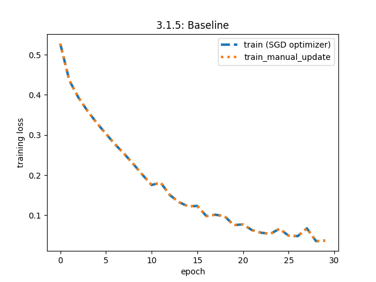

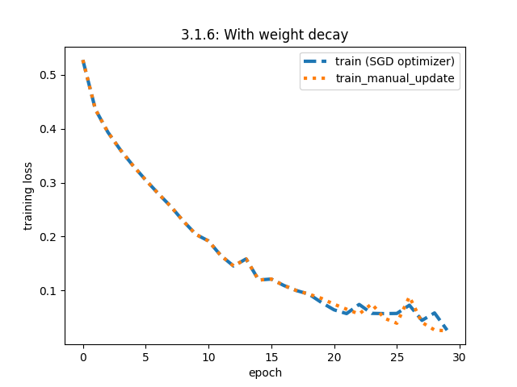

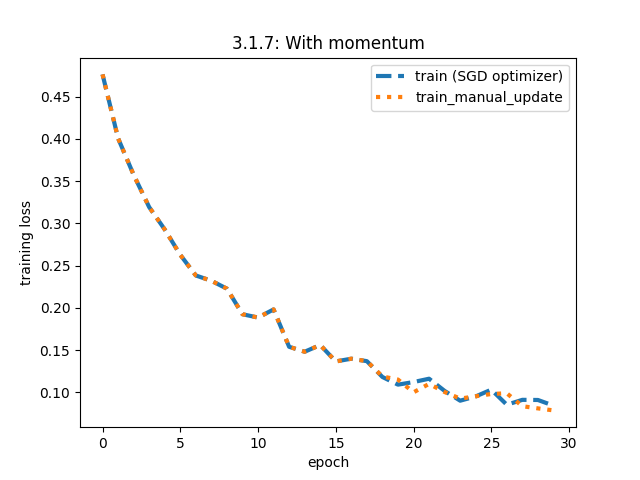

### Machine learning pipelines

## 3.

We split the data up, 90% of the data in allocated to training, and validation / test both having 5% of the data. We split this away because neural networks are quite data hungry. The validation and test sets may have a low amount of data, but we still believe they can help us find a good model.

We preprocessed by normalizing (based on train only), and transformed the validation/test data based on the training data normalization values.

Then, we did some data exploration.
Looking at some of the (normalized) images from the training data:

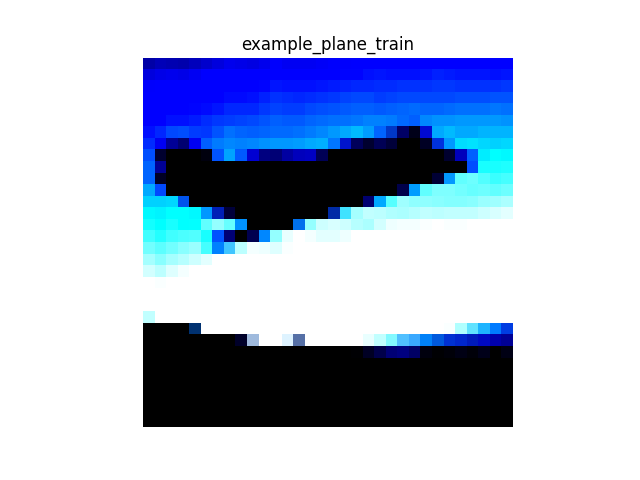
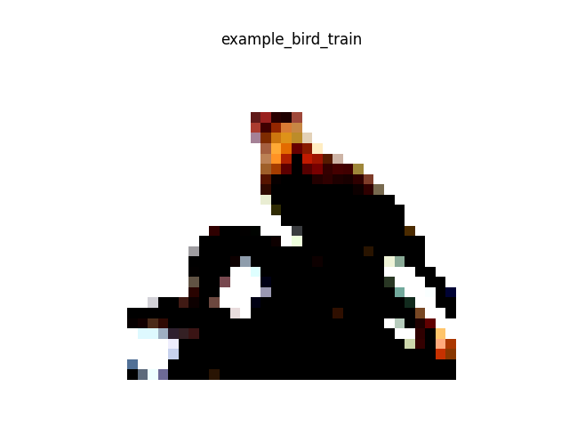

These two example images look different enough, I think a model could be able to differentiate the two.

Lets check the class distribution:

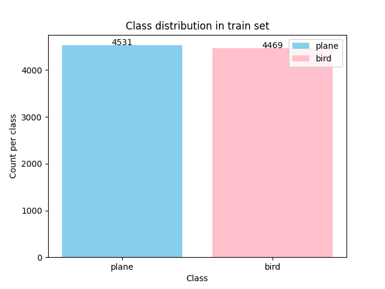

Accuracy will be good here. One could consider a performance measure like F1 score if the data in unbalanced, but this looks good, accuracy will work.

### Results

We had 4 different models, a baseline, a deep one, a wide one, and a model with dropout enabled.

Here are the hyperparameters chosen to try:

| Parameter      | Values       | Notes                                       |
| -------------- | ------------ | ------------------------------------------- |
| Learning Rate  | 0.001, 0.01  |                       |
| Momentum       | 0.5, 0.9     |                       |
| Weight Decay   | 0.0001, 0.01 |                       |
| Dropout Rate   | 0.2, 0.4     | Only for dropout model                      |
| Epochs Checked | 5, 15, 30    | Model performance evaluated at these points |

We chose these in order to have a fair amount of hyperparameters, without having too many, causing training to take a long time. We could maybe have tried values of 0 for params such as momentum, weight decay, etc, but we thought this would be more interesting. *We also talked to a group leader, she said these were good.*

We chose to run our models for **30** epochs maximum, to reduce training time.
As stated above, we evaluate model performance while training, at 5, 15 and 30 epochs.


Below are the model architectures as well as how the models performed.

### Baseline:

*Architecture*:
```text
inp layer: 3072 - 512 -> relu
hid layer: 512 - 128 -> relu
hid layer: 128 - 32 -> relu
out layer: 32 - 2 no activation function
```

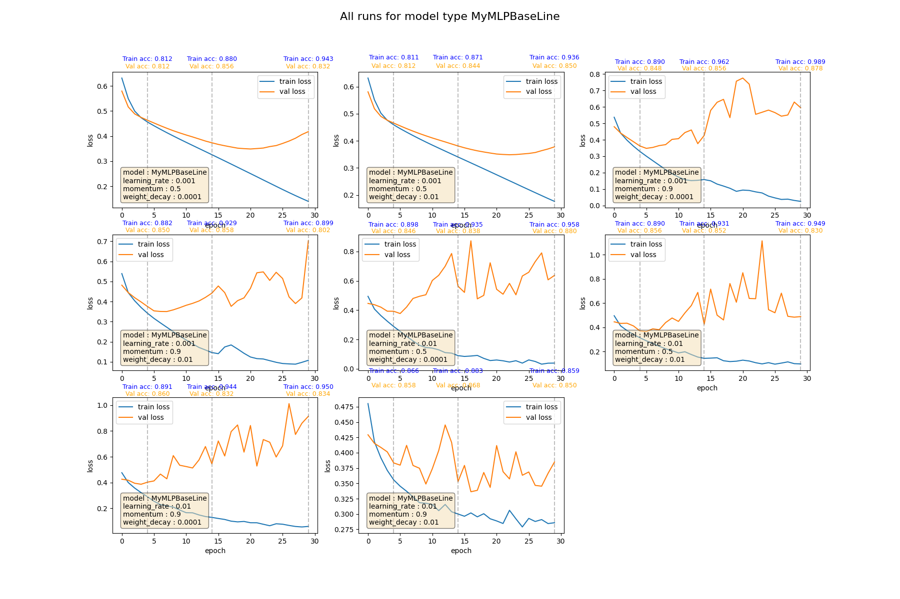

We see a lot of different behviour in this model, depending on the hyperparameters.
An interesting model is the one in the bottom left, this model has a high learning rate at 0.01 and a lot of momentum. What we see is that the model overfits as its training loss goes down a lot. This makes sense with its hyperparameters, as when the model starts to move in one direction, it can be hard to change its direction. Interestingly, as the model's validation loss increases, but the validation accuracy does not change much over the epochs.
This is a good example of how a loss function and performance metric are not the same thing! The loss increasing means that the model is less and less sure of the correct target, but it is atleast over 50% since the validation accuracy is decent.

Generally, these models all learn, but some learn slower, and some overfit.

### Deeper model:

*Architecture*:
```
inp layer: 3072 - 512 -> relu
hid layer: 512 - 128 -> relu
hid layer: 128 - 64 -> relu
hid layer: 64 - 32 -> relu
out layer: 32 - 2 no activation function
```

This deeper network has an additional layer. This can help the model learn more complex features, but may also increase overfitting (a regular risk when making a model more complex). 


Some of the models, with the bottom left model in particiular, are overfitting. This model (,uch like the top left in the baseline) sees a steep decline in training loss (and a correspoding HIGH training accuracy), but the validation loss is gradually increasing. The validation accuracy is actually quite good, but as disucssed, these are not the same.
The deeper model can capture more of the image features, and more of its weights can adjust to the training data, learning it better. It's weights with a high learning rate (0.01) and momentum (0.9) support this aggressive learning style.

Two interesting runs here ar the top left and top middle runs. They have the same parameters except for weight decay. The model with a higher weight decay (middle top) has a validation loss that increases less steeply than the model with a lower weight decay. This is because the model with a higher weight decay is punished for having weights (not biases) with high values. So when the model is overfitting to the training data, the high weight decay of the middle model forces it to not have weights which get very large. The top left model is much less restricted by weight decay, so it may overfit using unreasonably large weights, causing validation loss to increase. 

### Wider model:

*Architecture*:
```text
inp layer: 3072 - 512 -> relu
hid layer: 512 - 256 -> relu
hid layer: 256 - 32 -> relu
out layer: 32 - 2 no activation function
```

This wider network has a layer with an increased size. This can help the model learn more complex features, but may (much like the deeper network) also increase overfitting (a regular risk when making a model more complex). 


Generally, the wider model performs much like the baseline, but seems to learn slightly faster, but also overfit worse.

### Model with dropout:

*Architecture*:
```
inp layer: 3072 - 512 -> relu (dropout)
hid layer: 512 - 128 -> relu (dropout)
hid layer: 128 - 32 -> relu (dropout)
out layer: 32 - 2 no activation function (no dropout)
```

This network is the same as the basline, but has dropout between each layer (except first -> second last -> output). Dropout is a form of regularization. What can happen in a network without dropout, is that two or more neurons can become very codependent. A neuron may focus a lot on a specific learned feature from the previous layer. However dropout makes it so neurons cannot always rely on one specific neighbour, more the general inputs. This (hopefully) causes neurons to generalize better from all input. One can imagine dropout as running many many different variations of the same network. 


Generally speaking, both the train and validation losses are a little more "jagged", compared to the sometimes smoother loss lines we see in other models. We see the models learn, but certain neurons are not always learning, they have been turned off, so not all neurons are learning at the same pace.

### Best model. 

The best model is selected by valiadation accuracy. The model with the best valiadation accuracy was one of the baseline models. Below you can see it's performance:

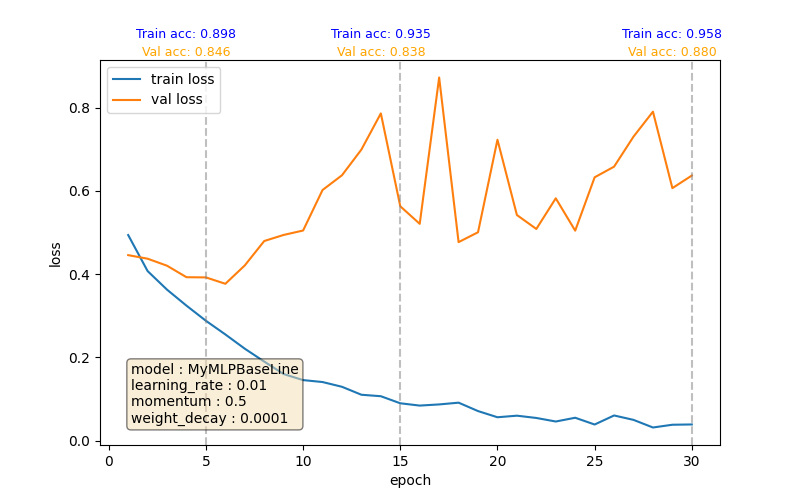

It had a validation accuracy of **0.880**, but this is not extraordinary, as other models had very close validation accuracies, like one of the wide models which acheived a validation accuracy of **0.878**.

What is interesting is this model seems to overfit, as its valiadation loss is quite high, but as disucssed earlier, loss function =/= performance metric. The validation loss is high and the model may be unsure, but the validation accuracy says this is the best model. Perhaps we should choose some other model, use early stopping or the likes, but for this project, we select based on validation accuracy.

Lets see some confusion matricies on the model performance:

**Train data**

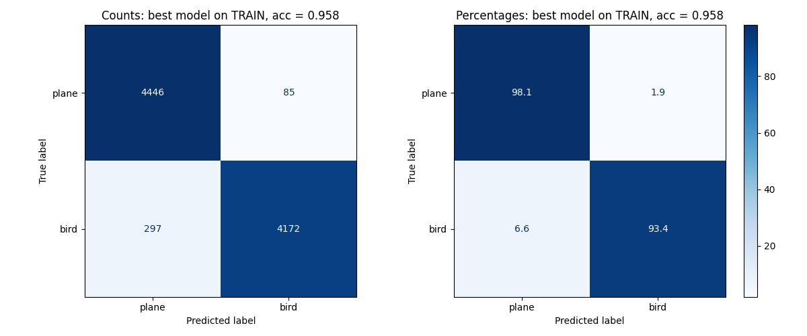

Generally, the model manages to guess almost all planes as planes. It is a little worse on birds, sometimes guessing them as planes. But the model performs well. The model may be able to get away with being slightly worse at one class since we are using accuracy and not F1 score.

**Validation data**

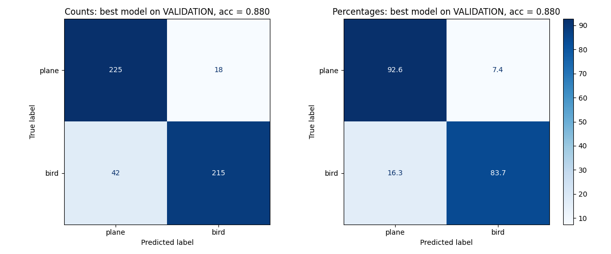

The validation data tells a similar story to that of the training data, as it does well on planes, and a fair bit worse on birds, albeit a bit worse across the board.

With a performance metric like accuracy, a model may sometimes get away with guessing slightly more of one class than the other. 

Generally, the model manages to guess almost all planes as planes. It is a little worse on birds, sometimes guessing them as planes. But the model performs well.

**Test data**

Finally, we tested the best model on test data. It got a test accuracy of **0.854**, which is pretty good. The model seems to have generalized well.

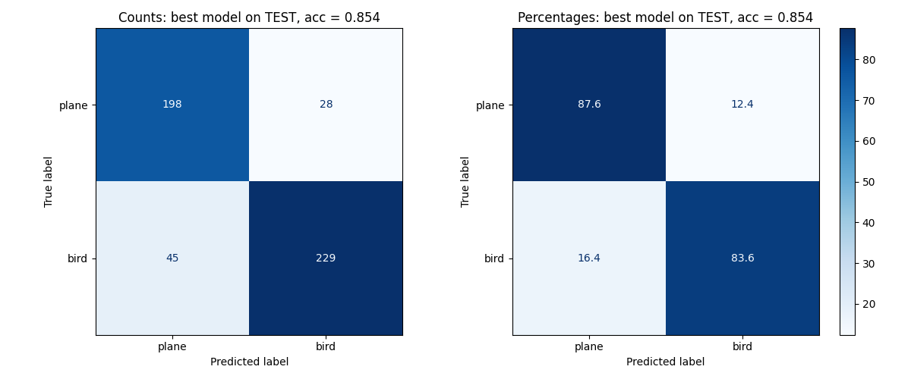

Again, a similar case for the test data, but now the model is worse on correctly predicting planes. The model generalizes, but not as well as on validation data. Perhaps the test data includes some particularly hard to spot images of birds/planes? Let's have a look.

**Incorrectly classified images**

Here are misclassified images in the test set and the model's confidence in its prediction.

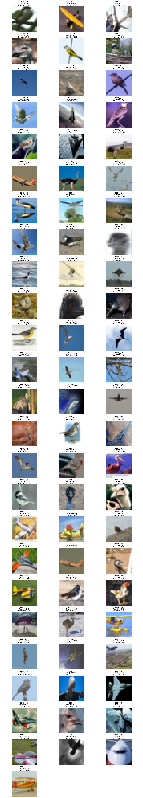

Some images are clearly very "On the edge", like the very first image (index = 0) includes a bird, but the probability of a plane (0.54) was just slightly higher. So this image was a toss up. Other images are completely different, for instance the image with index = 3, the model is 100% certain is a plane, while we can see it is a close-up of a bird.

Closeups seem to really confuse the model, as it tends to be very incorrect, being 100% sure closeups of bird and planes, and vice-versa.

Why is the model making mistakes? First off, the task is hard. Birds and planes are oftentimes in the sky, so using the blue background is not an option to distinugish them.
The specific model we chose actually had quite a high validation loss, and this can help explain the sometimes wildly incorrect predictions.

### Did something go against expectations?

I had high hopes for the dropout model as from previous experience, these can be very effective. Perhaps given more data, time, layers or "wideness", these could perform well.

## Conclusion:

Generally, the models perform well, but vary depending on the parameters chosen. Certain models overfit, others struggle to learn. Overall, many of the images were correctly identified, and the model generalized.

## On the use of AI

AI was used in this project, to assist in bug-fixing, plot creation, and understanding of the learning material.
AI has been cited in the code where appropriate.
