# INF265: Project 2: CNN

## 1. Object localization:

### Data exploration, preprocessing

We did not use the pre-processed bounding box data, we implemented the `global_to_local` and `local_to_global` functions.

We initially normalized the data, then plotted some of the images with their items and bounding boxes:

We then had a look at the class distribution.

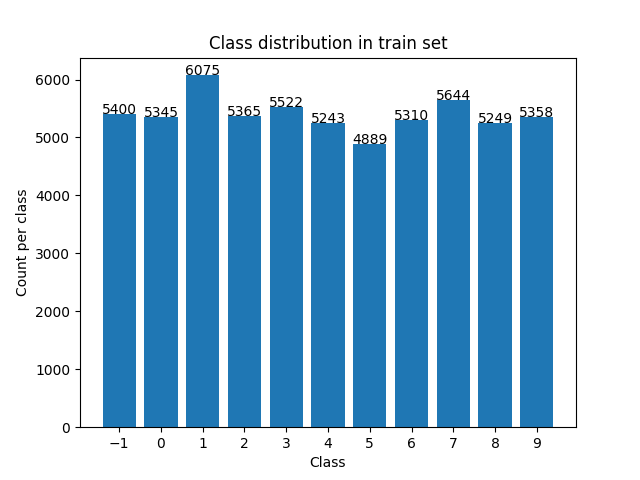

Seems like classes are mostly balanced, looks good.

We then plotted how many images have an item vs no item.

Seems like the distribution is unequal, the model could get away with guessing that there is an item in the image when there actually is none, so we should keep track of how good the model is at guessing if there is an item in the image or not.

Next we had a look at the pixel value distribution

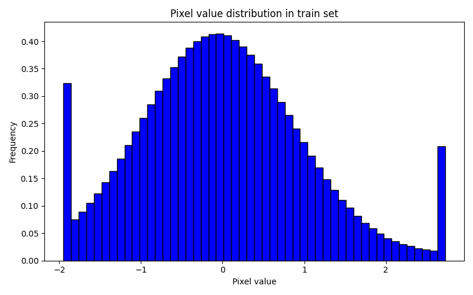

Looks alright, normalization worked.

Next up, we had a look at the pixel values outside/inside the bounding boxes.

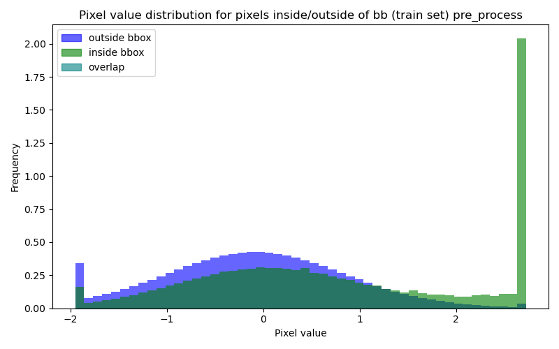

Seems like the pixels we are interested in tend towards higher values.
We tried to de-noise the data by setting all pixels under a value of 1.5 to 0.

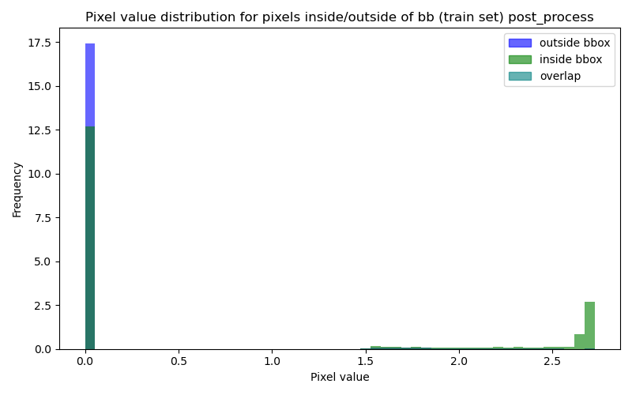

Now there is a clear divide!

And the images still look ok. Nice, hopefully this helps the model.

### Model definitions

## 1. Approach & Design choices

### Data exploration:

We initially normalized the data.

Then, we did some data exploration.
Looking at some of the images from the training data:

The images look different enough, a model could for sure learn the different labels. Each of the bouding boxes also seem appropriate.

Lets check the class distribution:

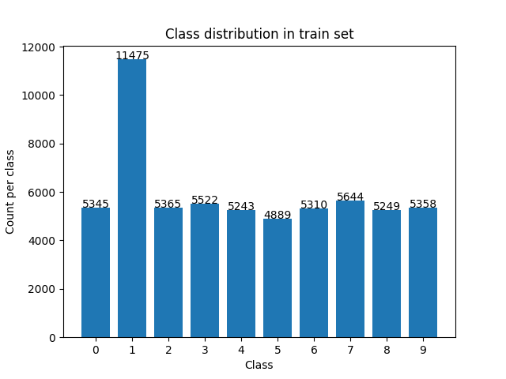

Hmm, seems like there is some class imbalance. One of the classes has twice the counts as all other classes. However, this should not cause any major issues. I dont think the model can get away with being very good at class 1 and ignoring the rest of the images.

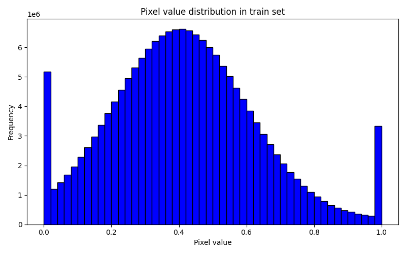
The pixel distribution is nice and normal, but there are (understandably), peaks at 0 and 1. Seems like very white and very black pixels are common in these images. Nothing weird here.

## 2. Models and hyperparameters

For object localization, we tried a wide range of models to see how they performed.

| Model                | Description                    |
|----------------------|--------------------------------|
| CNNBaselineNoBatch   | Basic CNN without BatchNorm    |
| CNNBaselineWithBatch | CNN with BatchNorm             |
| CNNDeep              | Deeper CNN + Batchnorm                     |
| CNNResNet            | CNN with residual connections + Batchnorm  |
| CNNDenseNet          | CNN with dense connections + Batchnorm     |

Since there is only one object per image, the models use fully connected layers for the final prediction.

The following hyperparameters have been used:

| Hyperparameter | Values       |
|----------------|--------------|
| Batch size     | 32           |
| N epochs       | 15           |
| Learning rate  | *1e-3, 1e-4*   |
| Weight decay   | *0, 1e-4*      |
| Dropout        | *0, 0.3*       |

A grid search over learning rate, weight decay and dropout was used during training of each model. Batch size and number of epochs were kept constant across all trainings.

Here all plots over all model performances:

Generally, the baseline with no batch performs ok... etc

Generally, the baseline with no batch performs ok... etc

Generally, the baseline with no batch performs ok... etc

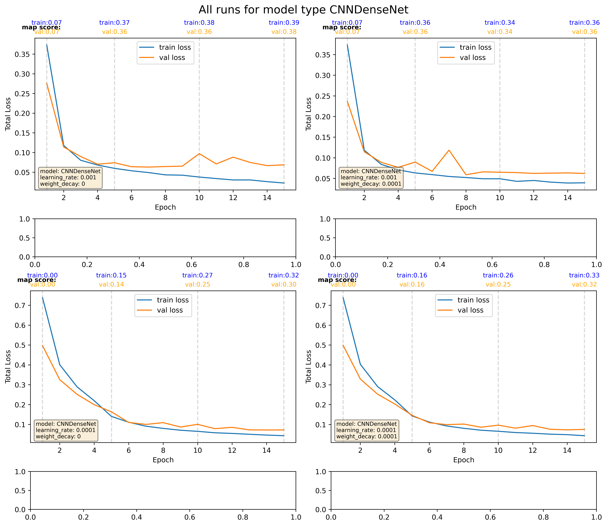

Generally, the baseline with no batch performs ok... etc

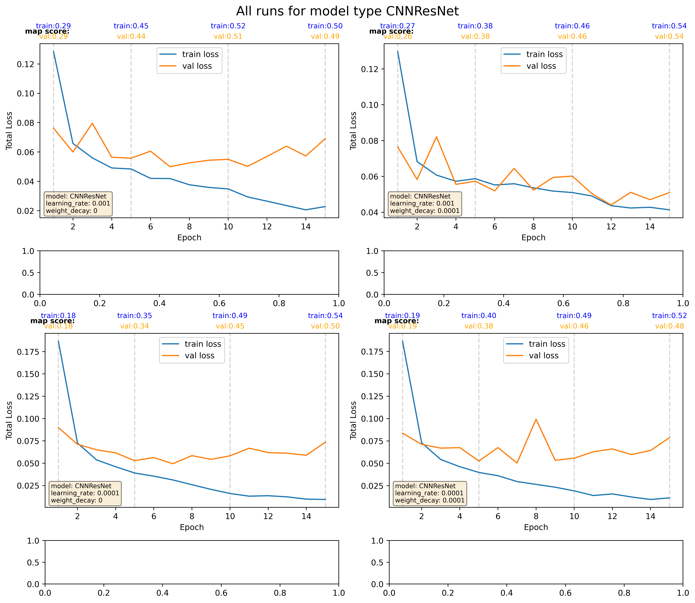

Generally, the baseline with no batch performs ok... etc

### Best model:

the best model was CNNResNet with these hyperparameters. It was chosen based on "map" score.

| Hyperparameter | Values |
|----------------|--------|
| Learning rate  | 1e-4   |
| Weight decay   | 1e-4   |
| Dropout        | 0.3    |

Here is its performance:

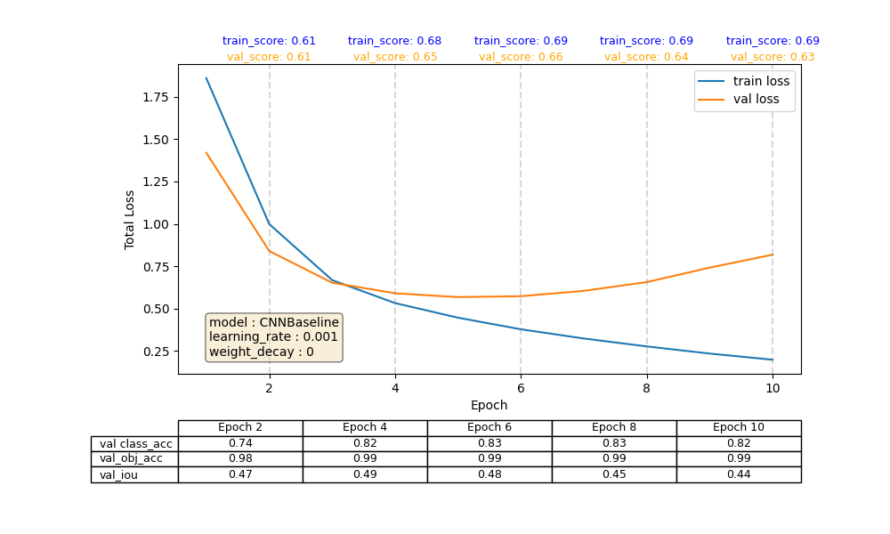

This model does quite well, maybe some overfitting towards the end. It has quite a high iou and class accuracy! Object accuracy is always high.

### 3. Performance

Lets look deeper into how the model performs.

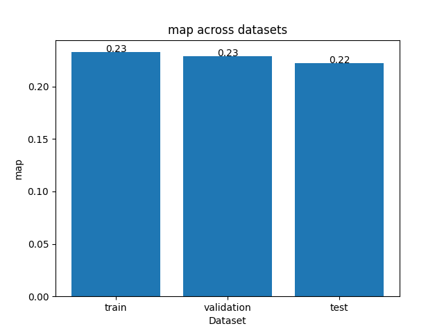

The model does very similaraly across all datasets, with a slight decrease in performance on test data. This is to be expected, but still shows that the model generalizes well.

Lets look at map_50 and map_75

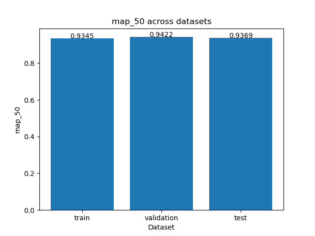

Wow! This is very high! Looks like the model does very well here. IT is #todo

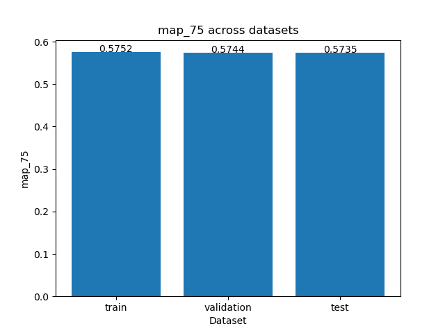

Much the same story as total map.

### Class confusion matrix

Lets look at a class confusion matrix.

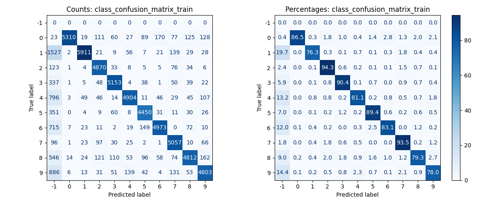

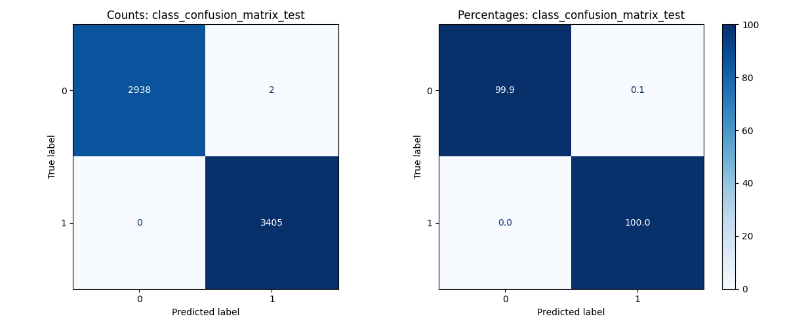

Seems like the model is quite good at understanding differences between 0/1 in an image. Both in training and test data.

Lets look deeper into bounding box rmse

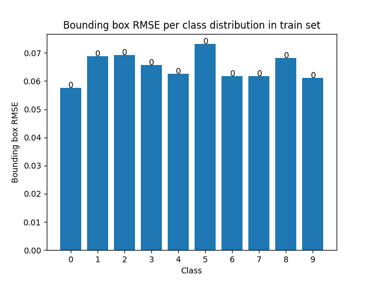

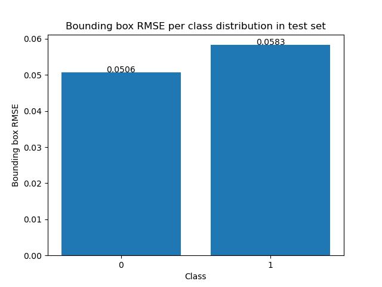

Seems like for both train and test, our RMSE for the images of the letter 1 are a fair bit higher, perhaps these bounding boxes are generally harder to predict?
This score may seem really low, but considering we are working with normalized data, this is actually fairly high.

Next, lets see our models predictions.

Firstly lets see ALL box predictions on training data:

Lets add non-max-suppression:

No difference.

Lets add non max suppression AND only pick boxes with a confidence higher than 0.5.

Looks like the model is struggling. Some images it gets right, but others it is completely off on.

Lets have a look at the test data:

Looks like our model is performing alright!

Sometimes our bounding box is not really covering the image, but generally our model manages to understand the class, and ish where the bounding box should be.

## 5. Results

### Object localization

The best model does not appears to underfit, but overfits slighty. Training accuracy is a little bit higher than validation accuracy, but not enough to suggest a severe overfitting.

The results show a good accuracy score, while IoU is lower. This suggests that the model struggles to accurately locate the bounding box for the objects.

# -----------------------------

# Object detection

### Object detection

For object detection, the following models have been used:

| Model                | Description                          |
|----------------------|--------------------------------------|
| CNNBaselineNoBatch   | Basic CNN without BatchNorm          |
| CNNBaselineWithBatch | CNN with BatchNorm                   |
| CNNLargeKernels      | CNN with larger convolution kernels  |
| CNNResNet            | CNN with residual connections        |
| CNNDenseNet          | CNN with dense connections           |

The same models are used here, except for using CNNLargeKernels rather than CNNDeep. 

The following hyperparameters have been used:

| Hyperparameter | Values              |
|----------------|---------------------|
| Batch size     | 32                  |
| N epochs       | 15                  |
| Learning rate  | 1e-3, 1e-4          |
| Weight decay   | 0, 1e-2, 1e-4       |

The same grid search over learning rate and weight decay was used during training, and batch size and number of epochs are constant across trainings.

### Object detection

For object detection, the best model was CNNResNet with these hyperparameters:

| Hyperparameter | Values |
|----------------|--------|
| Learning rate  | 1e-3   |
| Weight decay   | 1e-4   |

The performance of this model on validation data was:

| Metric                   | Value  |
|--------------------------|--------|
| Accuracy                 | 0.9984 |
| IoU                      | 0.7812 |
| Mean of accuracy and IoU | 0.8898 |
| Mean Average Precision   | 0.5417 |

The graph below shows the map score of this model through the epochs.

(SETT INN BILDE)

### Results
# todo

We had 4 different models, a baseline, a deep one, a wide one, and a model with dropout enabled.

Here are the hyperparameters chosen to try:

| Parameter      | Values       | Notes                                       |
| -------------- | ------------ | ------------------------------------------- |
| Learning Rate  | 0.001, 0.01  |                       |
| Momentum       | 0.5, 0.9     |                       |
| Weight Decay   | 0.0001, 0.01 |                       |
| Dropout Rate   | 0.2, 0.4     | Only for dropout model                      |
| Epochs Checked | 5, 15, 30    | Model performance evaluated at these points |

We chose these in order to have a fair amount of hyperparameters, without having too many, causing training to take a long time. We could maybe have tried values of 0 for params such as momentum, weight decay, etc, but we thought this would be more interesting. *We also talked to a group leader, she said these were good.*

We chose to run our models for **30** epochs maximum, to reduce training time.
As stated above, we evaluate model performance while training, at 5, 15 and 30 epochs.

Below are the model architectures as well as how the models performed.

### Baseline:

### Best model.

The best model is selected by valiadation accuracy. The model with the best valiadation accuracy was one of the baseline models. Below you can see its performance:

It had a validation accuracy of **0.880**, but this is not extraordinary, as other models had very close validation accuracies, like one of the wide models which acheived a validation accuracy of **0.878**.

What is interesting is this model seems to overfit, as its valiadation loss is quite high, but as disucssed earlier, loss function =/= performance metric. The validation loss is high and the model may be unsure, but the validation accuracy says this is the best model. Perhaps we should choose some other model, use early stopping or the likes, but for this project, we select based on validation accuracy.

Lets see some confusion matricies on the model performance:

**Train data**

Generally, the model manages to guess almost all planes as planes. It is a little worse on birds, sometimes guessing them as planes. But the model performs well. The model may be able to get away with being slightly worse at one class since we are using accuracy and not F1 score.

**Validation data**

The validation data tells a similar story to that of the training data, as it does well on planes, and a fair bit worse on birds, albeit a bit worse across the board.

With a performance metric like accuracy, a model may sometimes get away with guessing slightly more of one class than the other. 

Generally, the model manages to guess almost all planes as planes. It is a little worse on birds, sometimes guessing them as planes. But the model performs well.

**Test data**

Finally, we tested the best model on test data. It got a test accuracy of **0.854**, which is pretty good. The model seems to have generalized well.

Again, a similar case for the test data, but now the model is worse on correctly predicting planes. The model generalizes, but not as well as on validation data. Perhaps the test data includes some particularly hard to spot images of birds/planes? Let's have a look.

**Incorrectly classified images**

Here are misclassified images in the test set and the model's confidence in its prediction.

Some images are clearly very "On the edge", like the very first image (index = 0) includes a bird, but the probability of a plane (0.54) was just slightly higher. So this image was a toss up. Other images are completely different, for instance the image with index = 3, the model is 100% certain is a plane, while we can see it is a close-up of a bird.

Closeups seem to really confuse the model, as it tends to be very incorrect, being 100% sure closeups of bird and planes, and vice-versa.

Why is the model making mistakes? First off, the task is hard. Birds and planes are oftentimes in the sky, so using the blue background is not an option to distinugish them.
The specific model we chose actually had quite a high validation loss, and this can help explain the sometimes wildly incorrect predictions.

### Did something go against expectations?

I had high hopes for the dropout model as from previous experience, these can be very effective. Perhaps given more data, time, layers or "wideness", these could perform well.

## Conclusion:

Generally, the models perform well, but vary depending on the parameters chosen. Certain models overfit, others struggle to learn. Overall, many of the images were correctly identified, and the model generalized.

## On the use of AI

AI was used in this project, to assist in bug-fixing, plot creation, and understanding of the learning material.
AI has been cited in the code where appropriate.
In [the format uib wishes](https://www.uib.no/en/nt/180737/examples-how-you-can-describe-use-ai-%E2%80%93-faculty-science-and-technology): The service ChatGPT has been used to generate code for plotting and debugging. ChatGPT was also used to inquire into the differences between loss function and performance measure in terms of this assignment.

## Divison of labour

Henrik Brøgger did parts 1 (backpropagation) and 3 (machine learning pipeline). While Tobias Skodven did part 2 (gradient descent). 
Report work was shared.

#
# notes:
# num of layers affects size of receptive field
# kernel size affects ability to see complicated things
# we need to use MAP

# we could compute bounding boxes and accuracy

# since we can really have inifnite true negatives, we have to use precision

# precsion : TP / TP + FP <- we can abuse by placing few boxes
# recall : TP / TP + FN <- we can abuse by placing many many boxes

# MAP:
# mean precision is mean precision for one class

# if iou is more than half then we got a TP
# but if multiple, pick the one with highest IOU, rest are FN